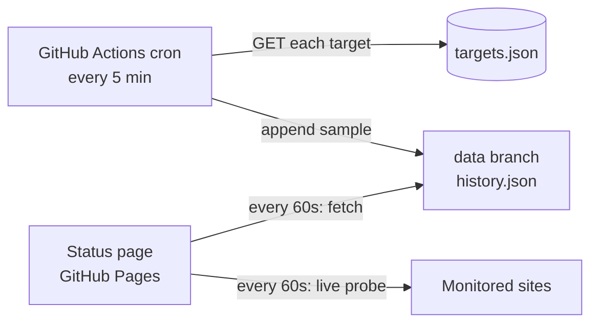

# Rolodex status

Uptime monitor and status page for the [Rolodex](https://github.com/Sun-Wukhan/rolodex)
demo, hosted on GitHub Pages: **https://sun-wukhan.github.io/rolodex-status/**

## How it works



- **Recorded checks:** `.github/workflows/check.yml` runs `scripts/check.mjs` every 5
  minutes (GitHub's minimum schedule; runs can be delayed under load). Each run requests
  every URL in `targets.json`, records status code and latency, and commits the result to
  the `data` branch. History is kept for 7 days to keep the branch small.
- **Status page:** `index.html` loads `history.json` from `raw.githubusercontent.com`, so
  new samples appear without a Pages rebuild. Every 60 seconds it refreshes the data,
  probes each target from your browser, and redraws the graph. Browser probes use
  `no-cors` requests, so they measure reachability and latency but not status codes; they
  are kept in `localStorage` for 24 hours.
- No secrets are involved: checks are anonymous GETs and the workflow uses the built-in
  `GITHUB_TOKEN` with `contents: write` only to push to the `data` branch.

## Adding a target

Add an entry to `targets.json` (validated by `parseTargets`):

```json
{ "id": "rolodex-api", "name": "Rolodex API", "url": "https://api.example.com/healthz", "expectStatus": 200 }
```

The Rolodex API has no public deployment today (it runs locally or on minikube), so the
hosted demo is monitored. When the API is deployed, add its `/healthz` URL here.

## Local development

```bash
npm test          # unit tests for the check and chart logic (node:test, no dependencies)
npm run check     # run the checks once, writing data/history.json
npm run serve     # serve the page at http://localhost:8000
```

## Tools

Plain HTML, CSS and JavaScript modules with no build step or runtime dependencies; the
chart is hand-rolled SVG. Built with Cursor (Claude) as a pair-programming assistant.
